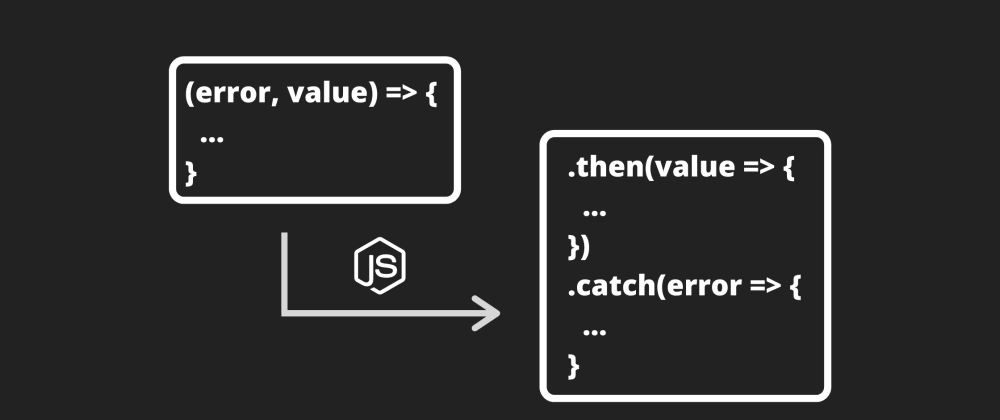

# Curso de Asincronismo con JavaScript

Puedes encontrar alguna de mis notas en [others/](./others/).

El curso se encuentra en: [Platzi](https://platzi.com/clases/asincronismo-js)

## Curso Anterior

[UltiRequiem/ECMAScript6Plus-Platzi](https://github.com/UltiRequiem/ECMAScript6Plus-Platzi)

### LICENSE

[MIT](./LICENSE)
# Curso de Asincronismo con JavaScript

# AsincronismoConJS
Curso de asincronismo con Javascript.

Javascript es un lenguaje de programación asíncrono y no bloqueante. Tiene un manejador de eventos (EventLoop) implementado en un único hilo para las interfaces de entrada / salida (I/O).

**Async / Await** es recomendable a utilizar en vez de promesas ya que conseguimos que nuestro código sea síncrono.

### Callbacks

***Ventajas:***

- Es simple
- Una función que llama a otra función
- Son universales y funcionan en cualquier navegador

***Desventajas:***

- Composición complicada
- Callback Hell
- Manejo de errores tedioso ya que no se pueden manejar excepciones

### Promesas
***Ventajas:*** 

- Facilmente enlazables con then
- Código más intuitivo
- Permite trabajar con asincronismo 
  
***Desventajas:***

- No maneja excepciones, solo un catch final.
- Propenso a errores si no retornamos la siguiente llamada
- Necesita un traspilador para poder usarse en algunos navegadores.
  
### Asyn - Await
***Ventajas:*** 

- Se pueden manejar excepciones mediante try-cath
- Mejor legibilidad del código 

***Desventajas:***
- Necesita un traspilador para poder usarse en algunos navegadores.

### Instalación de dependencias
-  npm install xmlhttprequest --save
* https://www.youtube.com/watch?v=bWvnWhVCHAc

API
Interfaz de programación de aplicaciones (Application Programming Interface). Es un conjunto de
rutinas que provee acceso a funciones de un determinado software.
Concurrencia
Cuando dos o más tareas progresan simultáneamente.
Paralelismo
Cuando dos o más tareas se ejecutan, literalmente, a la vez, en el mismo instante de tiempo.
Bloqueante
Una llamada u operación bloqueante no devuelve el control a nuestra aplicación hasta que se ha
completado. Por tanto el thread queda bloqueado en estado de espera.
Síncrono
Es frecuente emplear ‘bloqueante’ y ‘síncrono’ como sinónimos, dando a entender que toda la
operación de entrada/salida se ejecuta de forma secuencial y, por tanto, debemos esperar a que
se complete para procesar el resultado.
Asíncrono
La finalización de la operación I/O se señaliza más tarde, mediante un mecanismo específico
como por ejemplo un callback, una promesa o un evento, lo que hace posible que la respuesta
sea procesada en diferido.
Call Stack
La pila de llamadas, se encarga de albergar las instrucciones que deben ejecutarse. Nos indica en
que punto del programa estamos, por donde vamos.
Heap
Región de memoria libre, normalmente de gran tamaño, dedicada al alojamiento dinámico de
objetos. Es compartida por todo el programa y controlada por un recolector de basura que se
encarga de liberar aquello que no se necesita.
Cola o Queue
Cada vez que nuestro programa recibe una notificación del exterior o de otro contexto distinto al
de la aplicación, el mensaje se inserta en una cola de mensajes pendientes y se registra su
callback correspondiente.
Eventloop o Loop de eventos
Cuando la pila de llamadas (call stack) se vacía, es decir, no hay nada más que ejecutar, se
procesan los mensajes de la cola. Con cada ‘tick’ del bucle de eventos, se procesa un nuevo
mensaje.
Hoisting
Sugiere que las declaraciones de variables y funciones son físicamente movidas al comienzo del
código en tiempo de compilación.
DOM
DOM permite acceder y manipular las páginas XHTML como si fueran documentos XML. De
hecho, DOM se diseñó originalmente para manipular de forma sencilla los documentos XML.
XML
Lenguaje de marcado creado para la transferencia de información, legible tanto para seres
humanos como para aplicaciones informáticas, y basado en una sencillez extrema y una rígida
sintaxis. Así como el HTML estaba basado y era un subconjunto de SGML, la reformulación del
primero bajo la sintaxis de XML dio lugar al XHTML; XHTML es, por tanto, un subconjunto de
XML.
Events
Comportamientos del usuario que interactúa con una página que pueden detectarse para lanzar
una acción, como por ejemplo que el usuario haga click en un elemento (onclick), que elija una
opción de un desplegable (onselect), que pase el ratón sobre un objeto (onmouseover), etc.
Compilar
Compilar es generar código ejecutable por una máquina, que puede ser física o abstracta como
la máquina virtual de Java.
Transpilar
Transpilar es generar a partir de código en un lenguaje código en otro lenguaje. Es decir, un
programa produce otro programa en otro lenguaje cuyo comportamiento es el mismo que el
original.

## Algunas APIS
* https://swapi.dev/
* https://github.com/public-apis/public-apis
* https://developer.marvel.com/
* https://rickandmortyapi.com/

## Definición Estructura Callback
Quisiera comentar algo y si estoy mal, por favor me corrigen:
La definición que el profe Oscar nos da: “Es una función que al crearla le pasamos como parámetro una segunda función”. Según lo que entiendo, eso no haría referencia directamente al callback, sino a la función que recibe como parámetro otra función.
Una función que recibe otra función como parámetro se le denomina función de orden superior (higher-order function).
El callback en este caso sería la función que es pasada como parámetro, mas no la función que lo recibe.

Por si a alguien le cuesta aun asimilar el concepto de los Callback…

Primero: Los callbacks son el nombre de una convención para usar funciones que llaman a otras en JavaScript. No hay una palabra reservada llamada “callback” en el lenguaje JavaScript que haga que nuestro código sea diferente o especial,
es mas una convención.
Tal es el caso que en lugar de llamar “callback” en el ejemplo de la clase, podemos llamarlo “suma” y funcionara igualmente.

Segundo y para que sirven? La mayoría estamos acostumbrados a programar de manera sincrona, es decir le indicamos al código que
por ejemplo defina un Valor “X” y con otro valor “Y” y realizamos un calculo (Por ejemplo una multiplicación).

El problema radica en que por ejemplo si quisiéramos crear un programa que nos convierta nuestra moneda (pesos) a su equivalente en Bitcoin,
podemos definir X (Valor de nuestro dinero) pero NO podemos definir de manera implícita “Y” (Precio del Bitcoin) por que es algo muy volátil. Entonces necesitamos obtener el precio del Bitcoin de una API, nuestro programa realiza una multiplicación de X * Y sin embargo no tenemos Y (precio del bitcion)
porque tenemos que esperar que el API nos conteste cual es este valor. Es ahí donde sirven los callback
.
Existen dos Metodos A y B
-El método B hace el calculo de nuestros Pesos * PrecioBitcoin
-El método A obtiene el precio del API de Bitcoin
Entonces el método B es llamado por el método A cuando por fin lee y obtiene el precio del Bitcoin, solo hasta entonces tiene sentido que multipliquemos nuestros valores.

## Peticiones a APIs usando Callbacks

Aclaraciòn de varias cosas que quizás no entiendas si estas empezando:

XMLHttpRequest es la forma antigua de hacer llamados, como el profesor lo menciona usa ese y no Fetch que es el actual, por que no conocemos aùn las promesas y fecth es con promesas, para saber por que el profesor uso OPEN y todas esas funciones aqui està la forma de usar XMLHttpRequest : https://developer.mozilla.org/es/docs/Web/API/XMLHttpRequest/Using_XMLHttpRequest.

" new Error " que el profesor crea, es una nueva instancia de la clase Error que tiene Javascript, son clases ya implicitas que tiene javascript en este caso es para monstrar bien un mensaje de error podemos usarla, màs informaciòn aqui : https://developer.mozilla.org/es/docs/Web/JavaScript/Referencia/Objetos_globales/Error.

Para los que son fron-end y están aprendiendo de Back, el profesor uso GET por que hace parte de los método http, en este caso necesitamos pedir información a las url ,màs información: https://developer.mozilla.org/es/docs/Web/HTTP/Methods

Por ultimo recomiendo una escucha atenta a lo que dice el profesor por que el explica el por que de cada cosa que hace y si no la conoces recomiendo buscarlas en Internet y asì avanzas en el curso.
    
